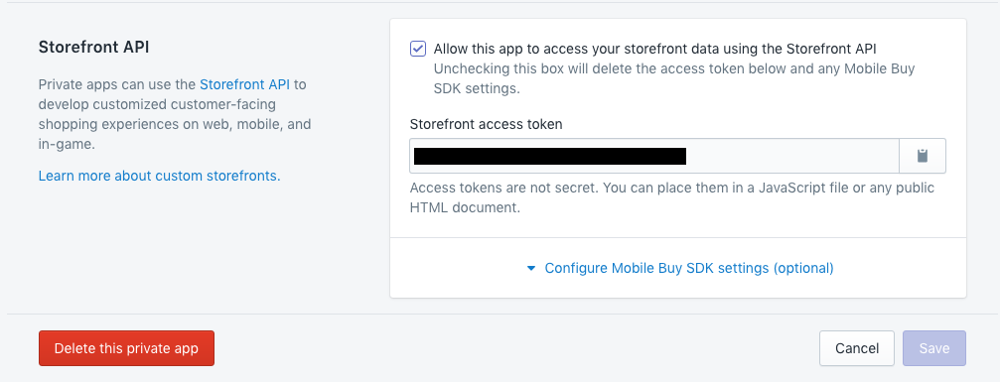

wp-shopify (WPS) is a [Vuepress](https://github.com/funkhaus/vuepress) plugin that integrates the [Shopify Storefront API](https://help.shopify.com/api/custom-storefronts/storefront-api) with Vuepress for fast and powerful store construction.

You'll need both this and the [Vue plugin](https://github.com/funkhaus/wp-shopify-js) to use WP-Shopify.

# Table of Contents

1.  [Installation](#installation)
    1.  [Dividing Responsibilities](#dividing-responsibilities)
1.  [Syncing](#syncing)
    1.  [Collections](#collections)
1.  [Front-End](#front-end)
1.  [Advanced](#advanced)
    1.  [Permalink Structure Slug](#permalink-structure-slug)
    1.  [Convenience Functions](#convenience-functions)
        1.  [General](#general)
        1.  [Single WPS-Product](#single-wps-product)

# Installation

1.  Set up Shopify:

    1.  Set up a Shopify store and create a new private app.

        1.  Go to your Shopify admin panel (`your-store.myshopify.com/admin`).
        1.  Click "Manage Private Apps" at the bottom of the screen. You'll end up on `your-store.myshopify.com/admin/apps/private`.
        1.  Click "Create a new private app."
        1.  Keep the default API permissions and make sure `Allow this app to access your storefront data using the Storefront API` at the bottom of the screen is checked.
        1.  Hit Save to continue.

    1.  Note the Storefront Token on the bottom of the next page:

    

    This page is accessible any time from `your-store.myshopify.com/admin/apps/private`.

1.  Set up Vuepress:
    1.  [Install Vuepress](https://github.com/funkhaus/vuepress/wiki).
    1.  Download this repo and drop it into your plugins folder. Enable it through your plugin settings and then navigate to `Settings > WP-Shopify`.
    1.  Put your Shopify domain (ie `your-store.myshopify.com`) and Storefront Token from earlier into the WPS settings.
    1.  Save your changes, then click Refresh Products. Your products and collections will auto-populate from your Shopify store.

## Dividing Responsibilities

WP-Shopify assumes that you'll be splitting up your shop's responsibilities.

-   Shopify will be the source of truth for:
    -   Product names
    -   Variants
    -   Prices
    -   Availability
    -   Collections
    -   Vendors
-   WordPress will be the source of truth for:

    -   Product descriptions
    -   Images
    -   Other metadata

## Syncing

**TL;DR** Go to "Settings -> WP-Shopify" and hit "Refresh Products" whenever you want to sync your shop's products.

**More detail:**

Your Wordpress site will now be synced to your Shopify Products and Collections. Products are stored as a custom post type called `wps-product`.

The product ID meta field (stored under the key `_wshop_product_id` on a `wps-product`) connects a product to its data on Shopify.

The only times you need to manually refresh your store (Settings > WP-Shopify > Refresh Products) are when:

-   You want to add or remove Products from your Wordpress site after setting them up on Shopify, or
-   You want to update your Collections information.

Basically, it's a good rule of thumb to refresh your store manually after making any significant changes on Shopify.

## Collections

Collections are a custom taxonomy for products that are managed automatically when syncing products.

WPS imports Collections as a custom taxonomy called `wps_collection`. Each Collection in Shopify becomes a term in the `wps_collection` taxonomy.

# Front-End

Once you've installed this plugin and synced your Shopify data to your WordPress site, head over to the [front-end Vue plugin](https://github.com/funkhaus/wp-shopify-js) to display data to the end user.

# Advanced

## Permalink Structure Slug

You'll see this option under **Settings > WP-Shopify**. Changing its value will rewrite the store's parent directory:

```
// Permalink Structure Slug set to 'store'
your-site.com/store/product-1

// Permalink Structure Slug set to 'xyz'
your-site.com/xyz/product-1
```

## Convenience Functions

### General

WPS comes with some convenience functions:

-   `get_wshop_collections_slug()` - Get the slug of the Collections archive page
-   `get_wshop_shop_slug()` - Get the slug of the wps-product archive page
-   `get_wshop_domain()` - Get the Shopify domain
-   `get_wshop_api_key()` - Get the Shopify API key

### Single `wps-product`

WPS comes with PHP convenience functions to check for, fetch, and display product IDs. Note that `$post` is optional in all of these functions and defaults to the current post.

-   `has_product( $post )` returns `true` if the page has a product ID set, `false` if not.
-   `get_the_product_id( $post )` is returns the product ID of a given page, as defined in the 'Product ID' metadata. If there is no product ID attached to a page, it returns a blank string.
-   `the_product_id( $post )` echoes the return value of `get_the_product_id()`.

---

**wp-shopify**

http://funkhaus.us

Version: 3.0

Requires at least WP 3.8
